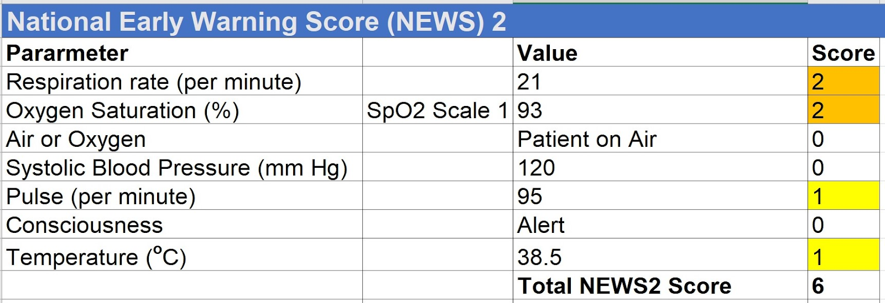



INTEROPen has developed the NEWS2 FHIR  specifications working in collaboration with NHS Digital as part FHIR Curation process with consultation with the INTEROPen community. 

The specification supports sharing of  NEWS2 final score and associated Vital Signs and their sub-scores  from Electronic Patient Records (EPRs)  to third party applications e.g. apps. 

This  <a href="https://nhsconnect.github.io/fhir-policy/publication.html#FHIR-PUB-04" target="_blank">**alpha**</a> specification was developed in a single sprint (3 weeks) starting on 1st October 2018 and a consultation call was held with the INTEROPen community on 12th October 2018. The recording of the call is available on youtube  <a href="https://www.youtube.com/watch?v=r9GVXTk4Qw4&feature=youtu.be" target="_blank">**here**</a>.  The presentation used in the call is available <a href="https://docs.google.com/presentation/d/1_FEnskc_xJWqg17XjBxvXutxEyWIaLA3N1K-U3h5CeE/edit?usp=sharing" target="_blank">**here**</a>. 

This alpha specification will be tested initially at the <a href="http://www.interopen.org/events/" target="_blank">**Inaugural INTEROPen Hackathon**</a> on 14th November. INTEROPen is actively seeking First of Type (FoT ) vendors and implementation sites to test this specification further.

The INTEROPen vision is to create a library of nationally defined HL7® FHIR® resources and interaction patterns that implementers can adopt to simplify integration and interoperability within England’s health and social care systems.

Find out more on the <a href="http://interopen.org/" target="_blank">**INTEROPen website**</a>.

Other possible use cases where this specification might apply include:

* A vital signs app to an Electronic Patient Record in a hospital
* Ambulance to Emergency Department
* Hospital to hospital patient transfers
* Hospital look up of observations in GP systems. They are able to import the Vital signs observations from GP Systems to build a single record of observations around a patient, so there is a baseline and trends available to all. 
* Ambulance recording on remote devices and communicating to central ambulance record
* GP to ambulance

## Quick Links ##
* The Message Design options for NEWS2 implementation are documented <a href="./messageoverview_overview.html">**here**</a>

* The FHIR resources used in a NEWS2 exchange are documented <a href="./news2_and_subscore_profiles.html">**here**</a>

## How NEWS2 Works ##
_Reproduced from: Royal College of Physicians. National Early Warning Score (NEWS) 2: Standardising the assessment of acute-illness severity in the NHS. Updated report of a working party. London: RCP, 2017._

The NEWS2 is based on a simple aggregate scoring system in which a score is allocated to physiological measurements, already recorded in routine practice, when patients present to, or are being monitored in hospital. Six simple physiological parameters plus an inspired oxygen observation form the basis of the scoring system:

1. respiration rate
2. oxygen saturation
3. systolic blood pressure
4. pulse rate
5. level of consciousness or new confusion*
6. temperature.
7. inspired oxygen

_*The patient has new-onset confusion, disorientation and/or agitation, where previously their mental state was normal – this may be subtle. The patient may respond to questions coherently, but there is some confusion, disorientation and/or agitation. This would score 3 or 4 on the GCS (rather than the normal 5 for verbal response), and scores 3 on the NEWS2 system._

A score is allocated to each parameter as they are measured, with the magnitude of the score reflecting how extremely the parameter varies from the norm. The score is then aggregated and uplifted by 2 points for people requiring supplemental oxygen to maintain their recommended oxygen saturation.

This is a pragmatic approach, with a key emphasis on system-wide standardisation and the use of physiological  parameters that are already routinely measured in NHS hospitals and in pre-hospital care, recorded on a standardised clinical chart – the NEWS2 chart.

A full description of NEWS2 is available from the Royal College of Physicians <a href="https://www.rcplondon.ac.uk/projects/outputs/national-early-warning-score-news-2" target="_blank">**here**</a>.

## Example Scenario ##
Mr Smith is 52 year old gentleman who attends the emergency department with  fever, cough and pleuritic pain with following vitals: 
* Respiratory rate: 21/min 
* Oxygen saturation : 93% 
* On air 
* Systolic blood pressure: 120 mmHg 
* Heart rate : 95/min 
* Consciousness: Alert 
* Temperature: 38.5 &deg;C 

